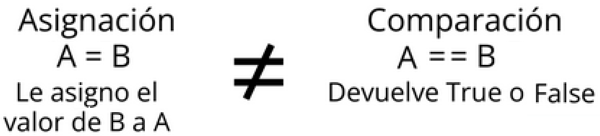
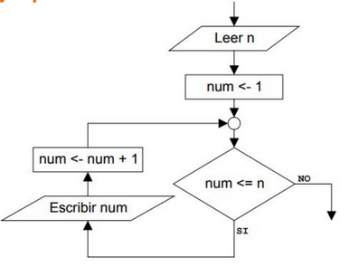
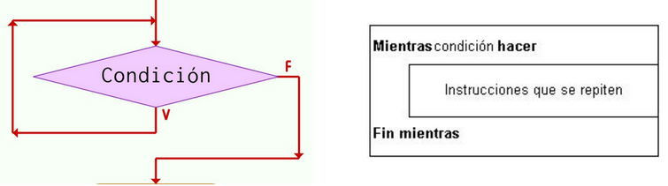
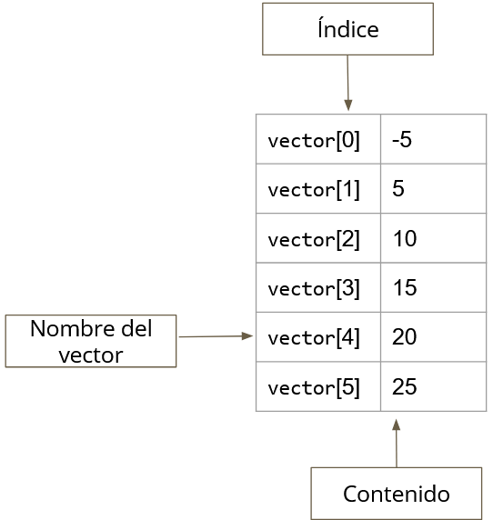

# <center>Contenido
## <center>Ejemplos
0. [Hola Mundo](./holaMundo.c)
1. [Tipo de Datos](./tipoDeDato.c)
2. [Operacionales Binarios](./operacionales.c)
3. [Operacionales Relacionales y Lógicos](./rangoMultiple.c)
4. [Validación de un número](./validoNum.c)
5. [For anidado - Dibuja un Triangulo](./triangulo.c)
6. [Recorrer Vector](./recorrerVector.c)
7. [Conversor](./conversor.c)
8. [Números aleatorios fijos](./numAleatoriosFijos.c)
9. [Números aleatorios](./numAleatorios.c)
10. [Números aleatorios en un rango](./numAleatoriosRango.c) 
11. [Números aleatorios en un rango de Inicio y Fin](./numAleatoriosIF.c) 
12. [Recorrer Matrices](./matrices.c)


## <center>Banco de Apuntes

### Variable  
En programación, una variable está formada por un lugar en la memoria y un **identificador** (nombre simbólico) que está asociado a dicho espachi. Ese espacio contiene una información conocida o desconocida, es decir un *dato*.

### Tipos de variables
|Tipo de Dato|Tamaño|
|-----------|:---:|
| char | 1 byte | 
| short | 2 bytes |
| int | 4 bytes |
| long | 4 bytes |
| float | 4 bytes |
| double | 8 bytes |
| long double | 16 bytes |
| bool | 1 byte |

> [!TIP]
> 1 byte = 8 bits

[Script de tipo de Datos](./tipoDeDato.c)

---
### Directivas  
Las palabras que empiezan con *#* se denominan directivas.  

**#define**  $\rightarrow$ Para definir constantes.  
**#include** $\rightarrow$ Para incluir el contenido de un *archivo.h*, se usa para importar funciones, variables, contantes, etc. de bibliotecas.  

```c
#include<stdio.h> //Invoco a la biblioteca stdio.h

#define N 5  //Sólo puede contener el valor de una constante
#define PI 3.1415926
``` 
---
### Tipos y especificadores de formato en las salidas printf  
| Especificador | Significado | | Especificador | Significado |
|:---:|:---| --- |:---:|:---|
| %c | Caracter | | %s | Cadena de texto |
| %d | Número Entero (int) | | %u | Entero sin signo |
| %D ó %ld | Número entero long | | %U | Entero sin signo long |
| %i | Número Entero (int) | | %x | Hexadecimal sin signo con minúscula |
| %f | Punto flotente (float) | | %X | Hexadecimal sin signo con mayúscula |
| %e | Notación científica con e minúscula | | %p | Puntero, dirección de memoria |
| %e | Notación científica con E mayúscula | | %n | Números de caracteres |
| %g | Utiliza %f o %e según sea más corto | | %o | Formato entero octal |
| %G | Utiliza %f o %E según sea más corto | | %O ó %lo | Formato entero octal long |
| %o | Número octal sin signo | | %lf | Formato double |

---
### Operadores Binarios
| Operador | Símbolo |
|-----------|:---:|
| Suma  | + |
| Resta  | - |
| Multiplicación  | * |
| División  | / |
| Módulo  | % |

[Script Operadores Binarios](./operacionales.c)  
[Script Conversor de Decimal a Binario, Octal y Hexadecimal](./conversor.c)

---
### Operador Asignación  
Es el valor que se le asigna a una variable, es decir, es el paso de valores o resultados a una zona de memoria.
```c
a = 5 ;      //Le asigno el valor 5 a la variable 'a'
b = 6.5 ;    //Le asigno el valor 6.5 a la variable 'b'
``` 
> [!IMPORTANT]
> No es lo mismo asignar (=) que igualdad (==)
>   

---
### Operadores Relacionales

Estos operadores sirven para comparar, es decir, devuelven True $(1)$ o False $(0)$.

Siendo:
```c
a = 5 ;
b = 6 ;
```  

| Símbolo |  Relación | Ejemplo | Solución |
|:---:|:---:|:---:|:---:|
| <  | Menor que | a < b | True |
| >  | Mayor que | a > b | False
| <=  | Menor o igual que | a <= b | True  |
| >=  | Mayor o igual que | a >= b | False |
| == | Igual a | a == b | False |
| !=  | Distinto a | a != b | True |

[Script Operadores Relacionales y Lógicos](./rangoMultiple.c)  
[Script Conversor de Decimal a Binario, Octal y Hexadecimal](./conversor.c)

---
### Operadores Lógicos
| Operador | Símbolo | |
|:---:|:---:| :---: |
| AND  | \&\& | y |
| OR  | \|\| | o |
| NOT  | ! | Negación |

[Script Operadores Relacionales y Lógicos](./rangoMultiple.c)  
[Script Conversor de Decimal a Binario, Octal y Hexadecimal](./conversor.c)

---
### Condicionales  
Esta sentencia de control permite ejecutar o no una sentencia simple o compuesta según se cumpla o no una determinada condición.  

```c
if(condicion){
  sentencias
}

if(condicion){
  sentencias
}else{
  sentencias2
}

if(condicion){
  sentencias
}else if(condicion2){ //Sino (condicion)
  sentencias2
}else{
  sentencia3
}
``` 

[Script condicional Anidado](./rangoMultiple.c) 

---
### Variable Contador  
Es una variable en la memoria que se incrementará en uno o un valor contante cada vez que se ejecute un ciclo. Es utilizado para llevar la cuenta de determinadas acciones. Tiene que estar en la decalración de variables y otorgarle un valor inicial.

### Variable Acumulador  
Es una variable en la memoria utilizada para almacenar cantidades variables. Se utiliza para efectuar sumas sucesivas.

> [!IMPORTANT]
> ACUMULADOR != CONTADOR  
> La principal diferencia es que la suma dentro del acumulador es variable, mientras que en el caso del contador es constante.

---
### Ciclos  
#### For  
Controlar la cantidad de veces que es ejecuta la instrucción mediante un *CONTADOR que debe ir evolucionando hasta alcanzar el valor deseado.  
Estructura del ciclo for:  
* **inicio** $\rightarrow$ Es una asignación, ejem ```i=0```
* **condición** $\rightarrow$ Es una condición, ejm ```i<30```
* **incremento** $\rightarrow$ Es el incremento, ejm ```i++```
```c
for (inicio ; condición ; incremento){
  bloque
}
```

  

[Script de For anidado](./triangulo.c)

#### While  
Es un ciclo repetitivo basado en los resultados de una expresión lógica. Su propósito es repetir un bloque de código mientras una condición se mantenga verdadera.  

```c
while (condición){
  bloque
}
```
> [!IMPORTANT]
> Condición de control   
> * Contador $\rightarrow$ Repetición definida $\rightarrow$ Se sabe con exactitud cuántas veces se ejecutará el ciclo.
> * Flag o Centinela $\rightarrow$ Repeticion indefinida $\rightarrow$ No se sabe con aticipación cuantas veces se ejecutará el ciclo. 

  

[Script Conversor de Decimal a Binario, Octal y Hexadecimal](./conversor.c)

#### DoWhile  
Es una estructura de control repetitiva que ejecuta un bloque de instrucciones al menos una vez, y luego sigue repitiéndolo mientras la condición sea verdadera.

```c
do{
  bloque
}while (condición);
```

[Script de Validación de un número](./validoNum.c)

---
### Vectores o Arrays  
Un vector es un conjunto de datos del mismo tipo, como números o cadenas, que están ordenados 'secuencialmente' y almacenados de forma contigua (es decir, uno al lado del otro) en memoria principal.
Tiene una longitud determinada. Se puede acceder a cada elemento mediante un índice, que comienza en cero.

  

[Script Formas de recorrer un Vector](./recorrerVector.c)  
[Script Conversor de Decimal a Binario, Octal y Hexadecimal](./conversor.c)

---
### Matrices
Es un vector, cuyos elementos son vectores.  
Cada elemento puede referenciarse con dos índices.  
Una matriz contiene de m x n elementosm lo que indica que tiene m renglones y n columnas.  

```c
tipoDeVariable nombreMatriz[renglon][columna]
```

[Script de matrices](./matrices.c)

---
### Archivos  


---
### Funciones útiles
* sizeof() $\rightarrow$ devuelve un número entero, la cantidad de bytes que usa la variable
* 


---
### Redondear
```c
printf("%.2f\n", numero); // Muestra con 2 decimales
printf("%.4f\n", numero); // Muestra con 4 decimales
```
[Script de operacionales](./operacionales.c)

---
### Generar números Aleatorios  
Como se ve en el ejemplo de acontinuación, se generan valores fijos de una semilla por más que se los vuelva a compilar va a devolver los mismos valores.  
[Script de números aleatorios fijos](./numAleatoriosFijos.c)  

Para generar números aleatorios mediante una semilla se necesita:  
* Función $\rightarrow$ *srand(int)* $\rightarrow$ Biblioteca $\rightarrow$ stdlib.h  
Esta función permite indicar la semilla o valor inicial que se usará para la generación de números aleatorios.  

* Función $\rightarrow$ *time(NULL)* $\rightarrow$ Biblioteca $\rightarrow$ time.h  
Se va a utilizar el reloj del sistema para generar una semilla de valores distintos.  

[Script de números aleatorios](./numAleatorios.c)  
[Script de números aleatorios en un rango](./numAleatoriosRango.c)  
[Script de números aleatorios en un rango de Inicio y Fin](./numAleatoriosIF.c)  


