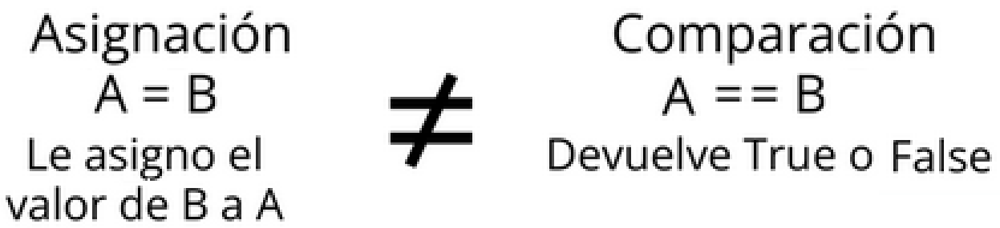
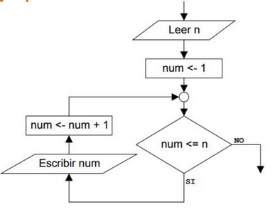
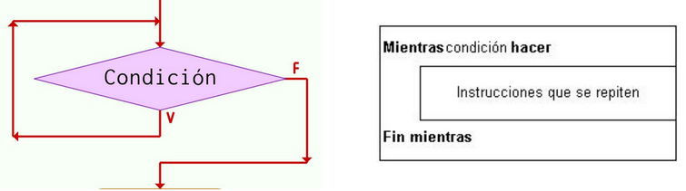
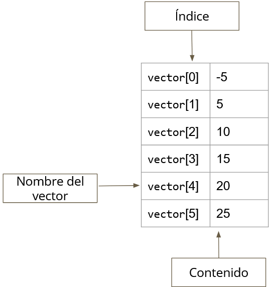

# <center>Contenido
0. [Hola Mundo](./holaMundo.c)
1. [Tipo de Datos](./tipoDeDato.c)
2. [Operacionales Binarios](./operacionales.c)
3. [Operacionales Relacionales y Lógicos](./rangoMultiple.c)
4. [Validación de un número](./validoNum.c)
5. [For anidado - Dibuja un Triangulo](./triangulo.c)
6. [Recorrer Vector](./recorrerVector.c)
7. [Conversor](./conversor.c)

# <center>Banco de Apuntes

### Tipos de variables
|Tipo de Dato|Tamaño|
|-----------|:---:|
| char | 1 byte |
| short | 2 bytes |
| int | 4 bytes |
| long | 4 bytes |
| float | 4 bytes |
| double | 8 bytes |
| long double | 16 bytes |
| bool | 1 byte |

[Script de tipo de Datos](./tipoDeDato.c)

---
### Operadores Binarios
| Operador | Símbolo |
|-----------|:---:|
| Suma  | + |
| Resta  | - |
| Multiplicación  | * |
| División  | / |
| Módulo  | % |

[Script Operadores Binarios](./operacionales.c)  
[Script Conversor de Decimal a Binario, Octal y Hexadecimal](./conversor.c)

---
### Operador Asignación  
Es el valor que se le asigna a una variable, es decir, es el paso de valores o resultados a una zona de memoria.
```c
a = 5 ;      //Le asigno el valor 5 a la variable 'a'
b = 6.5 ;    //Le asigno el valor 6.5 a la variable 'b'
``` 
> [!IMPORTANT]
> No es lo mismo asignar (=) que igualdad (==)
> 

---
### Operadores Relacionales

Estos operadores sirven para comparar, es decir, devuelven True $(1)$ o False $(0)$.

Siendo:
```c
a = 5 ;
b = 6 ;
```  

| Símbolo |  Relación | Ejemplo | Solución |
|:---:|:---:|:---:|:---:|
| <  | Menor que | a < b | True |
| >  | Mayor que | a > b | False
| <=  | Menor o igual que | a <= b | True  |
| >=  | Mayor o igual que | a >= b | False |
| == | Igual a | a == b | False |
| !=  | Distinto a | a != b | True |

[Script Operadores Relacionales y Lógicos](./rangoMultiple.c)  
[Script Conversor de Decimal a Binario, Octal y Hexadecimal](./conversor.c)

---
### Operadores Lógicos
| Operador | Símbolo |
|:---:|:---:|
| AND  | \&\& |
| OR  | \|\| |
| NOT  | ! |

[Script Operadores Relacionales y Lógicos](./rangoMultiple.c)  
[Script Conversor de Decimal a Binario, Octal y Hexadecimal](./conversor.c)

---
### Condicionales  
Esta sentencia de control permite ejecutar o no una sentencia simple o compuesta según se cumpla o no una determinada condición.  

[Script condicional Anidado](./rangoMultiple.c) 

---
### Ciclos  
#### For  
Controlar la cantidad de veces que es ejecuta la instrucción mediante un *CONTADOR que debe ir evolucionando hasta alcanzar el valor deseado.  


[Script de For anidado](./triangulo.c)

#### While  
Es un ciclo repetitivo basado en los resultados de una expresión lógica. Su propósito es repetir un bloque de código mientras una condición se mantenga verdadera.  

  

[Script Conversor de Decimal a Binario, Octal y Hexadecimal](./conversor.c)

#### DoWhile  
Es una estructura de control repetitiva que ejecuta un bloque de instrucciones al menos una vez, y luego sigue repitiéndolo mientras la condición sea verdadera.

[Script de Validación de un número](./validoNum.c)

---
### Vectores o Arrays  
Un vector es un conjunto de datos del mismo tipo, como números o cadenas, que están ordenados 'secuencialmente' y almacenados de forma contigua (es decir, uno al lado del otro) en memoria principal.
Tiene una longitud determinada. Se puede acceder a cada elemento mediante un índice, que generalmente comienza en cero.



[Script Formas de recorrer un Vector](./recorrerVector.c)  
[Script Conversor de Decimal a Binario, Octal y Hexadecimal](./conversor.c)

---
### Matrices

---
### Archivos  


---
### Funciones útiles
* sizeof() $\rightarrow$ devuelve un número entero, la cantidad de bytes que usa la variable
* 


---
### Redondear
```c
printf("%.2f\n", numero); // Muestra con 2 decimales
printf("%.4f\n", numero); // Muestra con 4 decimales
```
[Script de operacionales](./operacionales.c)


