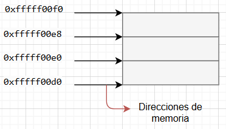

[Index](./index.md) | [PROXIMO TEMA]() | [PROXIMO TEMA]()  

# <center> 📚 Contenido  
## <center>🔰 Ejemplos  
1. [Notación](./punteros/notacion.c)
2. [Uso básico de punteros](./punteros/pasajeDir.c)
3. [Relacion entre arrays y punteros](./punteros/arrays.c) 
4. [Punteros y funciones](./punteros/funciones.c)  

## <center>📂Banco de Apuntes
### Memoria  
Dispositivo utilizado para almacenar datos (en binario).
Características principales
* Capacidad de almacenamiento
* velocidad de accedp (leer, escribir)
* Permanencia de datos

En el contexto de la programacion es un conjunto de espacios que contien algún tipo de dato (número,caracter,etc.) en dormato de bits (en binario).  
Cada espacio tiene una dirección de memoria única que los identifica.  
Cada casillero de memoria es de 1byte

---
### Punteros  
Sirven para averiguar donde estan almacenadas las variables.  
Cada casillero de memoria es de 1byte y cada uno posee una dirección única. Todas las variables tienen asociadas una dirección de memoria, pero se las identidica con la dirección de la primer celda que ocupan.  
  

Un *Puntero* es un tipo de dato que sirve para almacenar una dirección de memoria de otra variable. Apunta a una variable si su contenido es la direccion de esa variable. Hay que indicar el tipo de dato va a apuntar.  
```c
tipo_dato *pf //el * indica que es un puntero

//EJEMPLO
int *p;     // *indica que es un puntero a entero
p=&x;   //Le paso la dirección de memoria de x a p
```
| Símbolo | Descripción |
|:---:|:---|
| * | Indica que es un puntero |
| & | Devuelve la dirección de memoria de una variable |
| %p | Para mostrar una dirección de memoria |  

[Script de notación para el uso de punteros](./punteros/notacion.c)  
[Script de uso de punteros](./punteros/pasajeDir.c)  

#### Relación entre arrays y punteros  
Los vectores son punteros, su nombre apunta al primer elemento se pueden usar indistintamente los operadores * y [] para acceder a un elemento del v[i] es equivalente *(v+i).  
[Script de relacion entre arrays y punteros](./punteros/arrays.c) 

#### Aritmética de punteros  
Se pueden sumar o restar un entero o se pueden restar punteros para saber la distancia en las unidades del dato al que apuntan. 
Los nombres de los vectores, matrices y estructuras estaticos (son los declarados con []), son punteros constantes por lo cual no se pueden modificar mediante aritmetica pero si se pueden usar en aritmetica.  

| Esto | Es lo mismo que esto |
|:---:|:---:|
| v | &v[0] |
| v+i | &v[i] |
| *(v+i) | v[i] |
| *v | v[0] |

[Script de punteros y funciones](./punteros/funciones.c)  

[Index](./index.md) | [PROXIMO TEMA]() | [PROXIMO TEMA]()