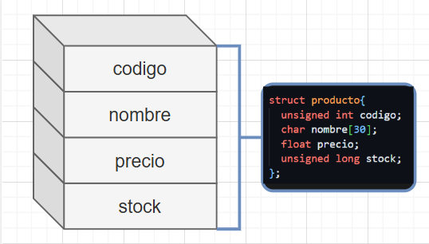

[Index](./index.md) | [Sistemas de Numeración, Máscaras y Shif](./mascarasYShif.md)  | [Funciones, Macros y Headers](./funcionesMacrosYHeaders.md)

# <center> 📚 Contenido  
## <center>🔰 Ejemplos  
1. 
2. 
3. 
4. 


## <center>📂Banco de Apuntes
### Structs  
Permite agrupar varios datos (campos) posiblemente de distintos tipos bajo un mismo identificador.  
Cada uno de los datos se denomina miembro de la estructura . La estructura se debe definir antes del main.    
El modelo o patron de la estructura es del siguiente modo:  
```c
struct nombreStruct{
  char var1[var1];
  unsigned int var2;
  float var3;
};  //Se debe poner ; después de cerrar las llaves
```  
  
Para acceder a los miembros del struct se debe utilizar **.**, procedido por el nombre del struct y por el identificador de la variable

```c
nombreStrct.var2;
```

LLamada mediante funciones
```c
tipo nombreFuncion(struct nombreStruct);
```


[Index](./index.md) | [Sistemas de Numeración, Máscaras y Shif](./mascarasYShif.md)  | [Funciones, Macros y Headers](./funcionesMacrosYHeaders.md)